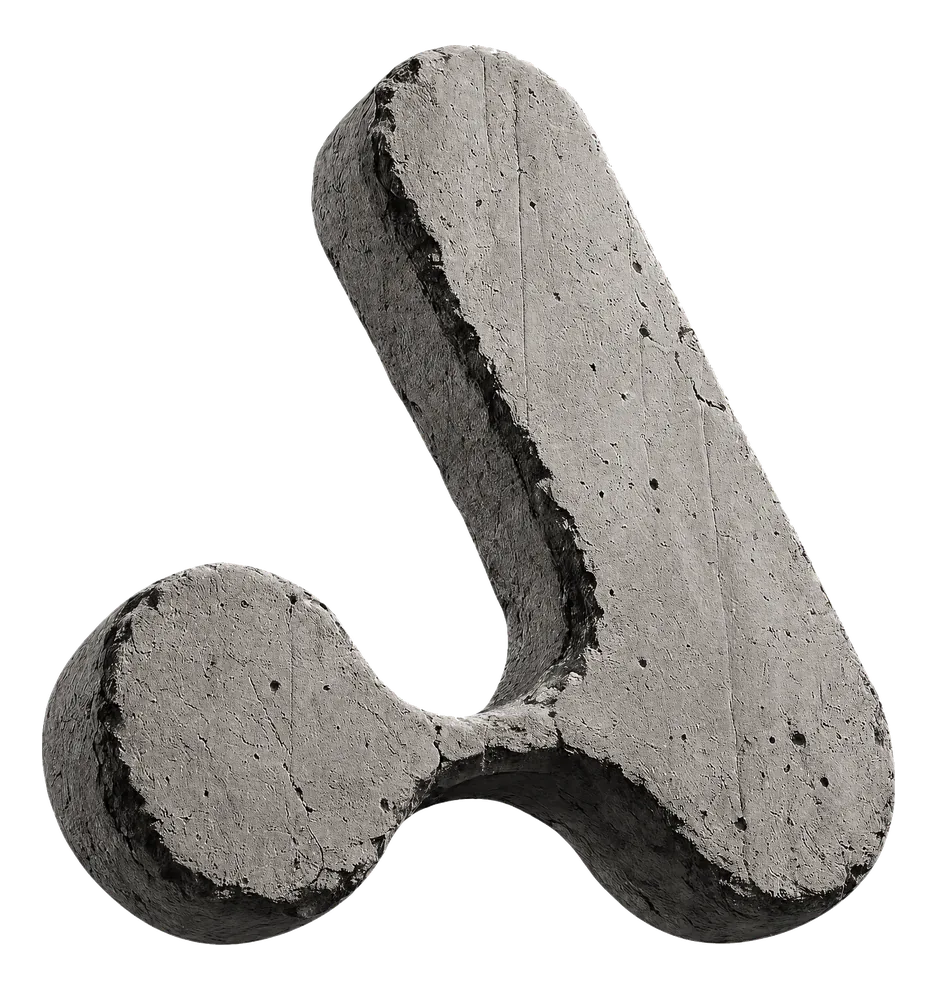
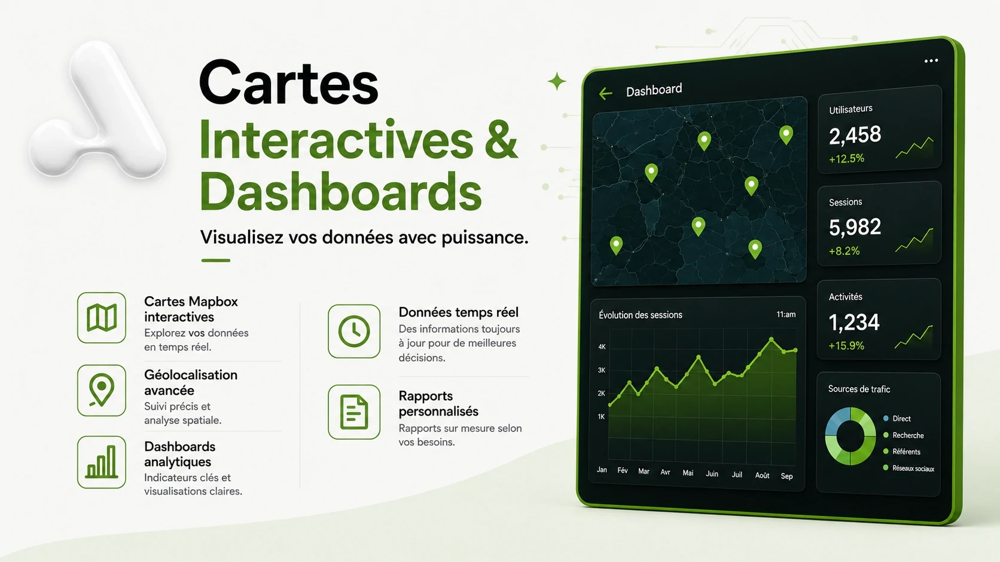
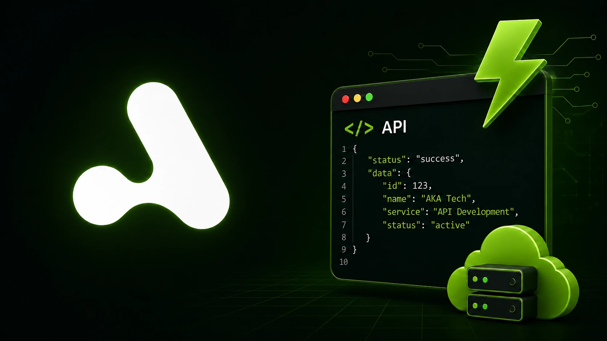
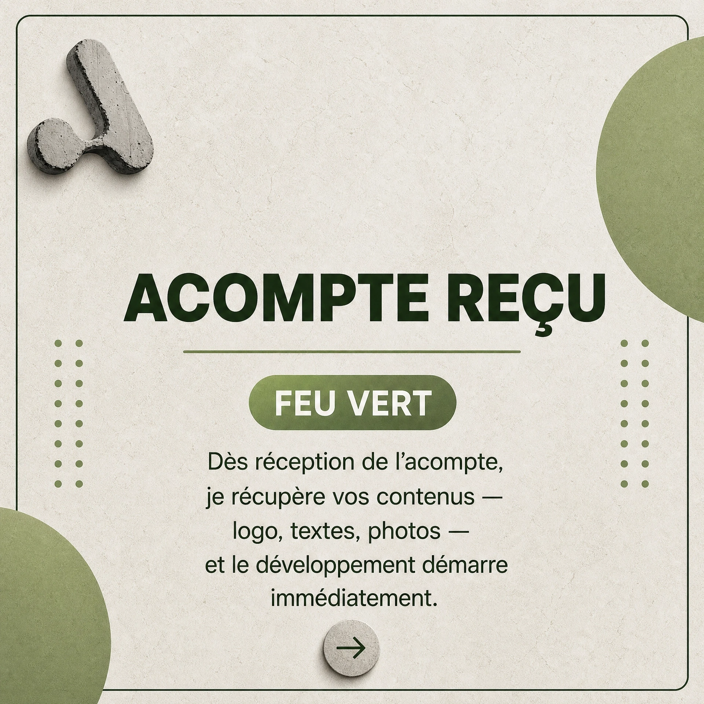
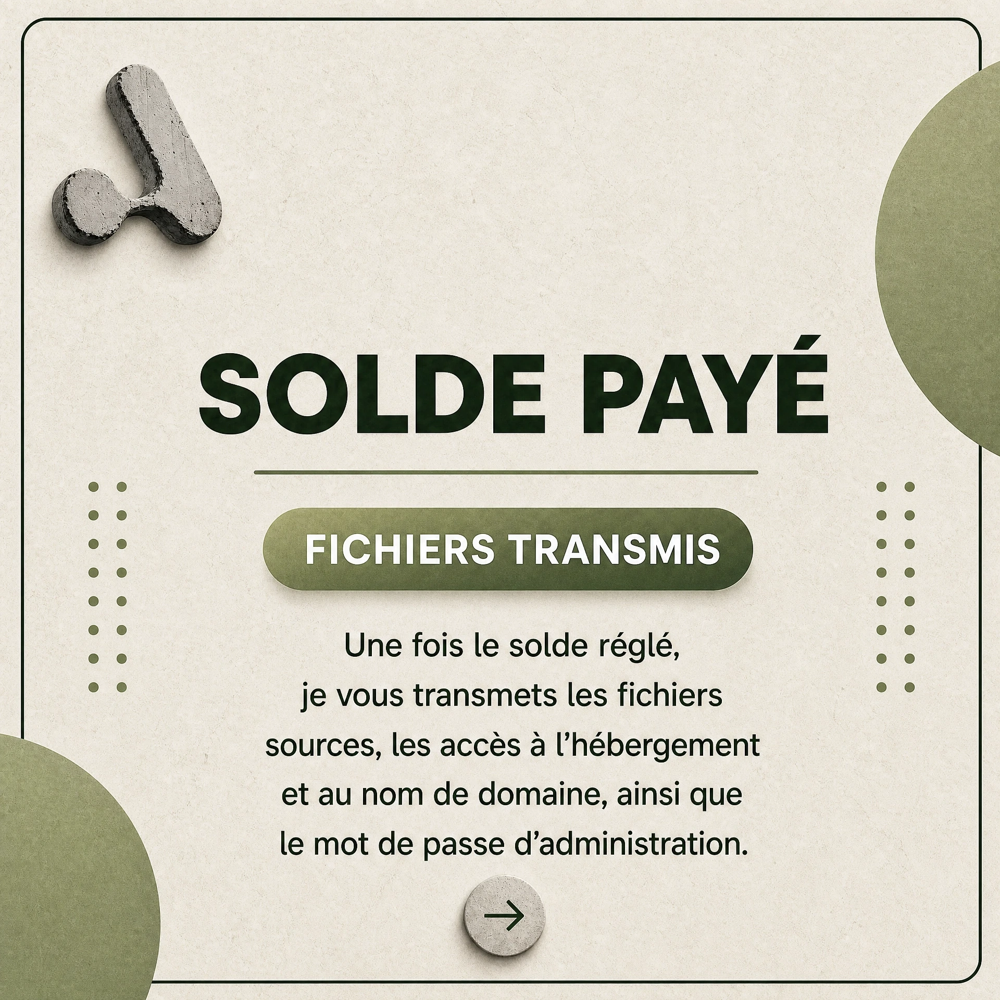

<div align="center">



# AKATech — Agence Web Abidjan

**Sites Vitrine · E-Commerce · Applications SaaS · API & Backend · Fiches Google My Business**

Développé par **M'Bollo Aka Elvis** — Développeur Full-Stack basé à Abidjan, Côte d'Ivoire 🇨🇮

[](https://akatech.vercel.app)
[](https://nextjs.org)
[](https://reactjs.org)
[](https://gsap.com)
[](https://threejs.org)
[](https://www.framer.com/motion)
[](https://aistudio.google.com)
[](https://groq.com)
[](https://prisma.io)
[](#)

</div>

---

## 📖 À propos

**AKATech** est une agence web freelance basée à **Abidjan, Côte d'Ivoire**, spécialisée dans la conception de solutions digitales sur-mesure pour les entrepreneurs, PME et créatifs d'Afrique de l'Ouest : sites vitrines, e-commerce, applications SaaS, API/backend et fiches Google My Business.

Ce dépôt contient le **site officiel d'AKATech** — la vitrine du Studio., construite avec **Next.js 14**, **GSAP** et **Three.js** — ainsi qu'un **assistant IA conversationnel** intégré au site public. Le SEO est pensé au-delà du référencement classique : données structurées **JSON-LD** taillées pour le SEO, l'**AEO** (moteurs de réponse type Google AI Overviews) et le **GEO** (recommandation par les LLM comme ChatGPT ou Perplexity).

> **Toutes les prestations sont développées directement par AKATech** — pas de sous-traitance, pas de templates génériques.

---

## 🛠️ Stack technique

| Techno | Version | Rôle |
|---|---|---|
| **Next.js** | 14.2.29 (App Router) | Framework React — routing, SSR |
| **React** | 18.2 | UI & composants |
| **GSAP** + ScrollTrigger | 3.12.5 | Animations scroll-driven, tunnel 3D |
| **Three.js** | 0.185 | Tunnel WebGL du mode Explorer |
| **Framer Motion** | 11 | Micro-interactions, transitions de page |
| **Lucide React** | 0.469 | Icônes vectorielles |
| **Resend** | 4.0 | Envoi d'e-mails (formulaire de contact) |
| **@google/genai** | 2.11 | Assistant IA — fournisseur principal (Gemini, gratuit) |
| **groq-sdk** | 1.3 | Assistant IA — fournisseur de secours (Llama 3.1 8B, gratuit) |
| **Prisma** + PostgreSQL (Neon) | 6.19 | Conversations, leads, visiteurs — alimente le dashboard admin |
| **@vercel/analytics** | 2.0 | Pageviews + Web Vitals (en complément du tracking interne visiteurs) |
| **Recharts** | 3.9 | Graphiques du dashboard admin |

**Design system :**
- Vert de marque `#88ca53` (dark mode) / `#5f9137` (light mode)
- Polices : **JetBrains Mono** (corps, UI) · **Space Grotesk** (titres) · **Anton** (labels du mode Explorer/Tunnel) · **Dancing Script** (accents décoratifs)
- Thème clair/sombre persistant, bascule en transition circulaire (**View Transitions API**, repli instantané sur Firefox)

---

## 📁 Structure du projet

```
akatech-nextjs/
├── middleware.js               # Basic Auth (/dashboard + API admin) + cookies de tracking visiteurs
├── prisma/
│   └── schema.prisma            # Conversation, Message, Lead, Visitor, VisitSession, PageView
│
├── app/
│   ├── page.js · HomeClientDesktop.js · HomeClientMobile.js · HomeResponsive.js
│   ├── layout.js              # Metadata SEO/AEO/GEO + JSON-LD ProfessionalService
│   ├── globals.css            # Design system, thème dark/light, responsive
│   ├── robots.js · sitemap.js
│   │
│   ├── about/                 # Équipe, stats animées, valeurs
│   ├── services/               # 5 domaines d'expertise, visuels WebP locaux
│   ├── projects/               # Galerie filtrée (19 réalisations)
│   ├── pricing/                 # 5 grilles tarifaires + FAQ
│   ├── blog/[slug]/            # 4 articles + recherche + newsletter
│   ├── contact/                 # Formulaire + canaux directs
│   ├── explorer/                # Tunnel 3D WebGL des projets (NEW)
│   ├── dashboard/                # Admin — leads, conversations, analytics (protégé par middleware)
│   │
│   └── api/
│       ├── contact/             # Route Resend + rate-limit anti-spam
│       ├── assistant/           # Chat IA — Gemini → Groq, tool use capture_lead
│       ├── assistant/end/       # Clôture une conversation en base (sans appel IA)
│       ├── track/                # Écrit visiteur/session/page vue en base (cookies posés par middleware.js)
│       
│
├── components/
│   ├── layout/    # Navbar, Footer, CardNav, StaggeredMenu, PageTransition, BlobTransition
│   ├── ui/        # AuroraHero, OrbHero, Loader, ConversionMarquee, TrustStacksMarquee, AIAssistant, VisitorTracker…
│   ├── explorer/  # ProjectsTunnel (Three.js live), ProjectModal, ProjectGlobe (dormant)
│   └── responsive/# ResponsiveLoader — bascule desktop/mobile par composant
│
├── lib/
│   ├── data.js         # SERVICES, PROJECTS (19), PRICING, TESTIMONIALS, TEAM, STATS, BLOG_POSTS, FAQ_ITEMS, PROJECT_TYPE_LABELS
│   ├── theme.js         # useTheme — dark/light + View Transitions
│   ├── assistant.js     # System prompt généré depuis lib/data.js + définition du tool capture_lead
│   ├── ai-providers.js  # Cascade de modèles Gemini, fallback Groq, rate-limiting, validation — partagé entre les routes assistant
│   
│
├── public/
├── next.config.js · vercel.json · jsconfig.json · package.json
```

> Chaque route suit le même schéma **Desktop / Mobile / Responsive-loader** — même logique de séparation que sur AKAFOLIO.

---

## 📄 Pages & fonctionnalités

| Route | Titre | Contenu principal |
|---|---|---|
| `/` | Accueil | Hero animé, services, marquees de confiance, projets récents, témoignages |
| `/about` | À propos | Équipe, stats animées, valeurs |
| `/services` | Services | 5 domaines d'expertise, processus en 7 étapes |
| `/projects` | Projets | Galerie filtrée par catégorie — 19 réalisations |
| `/explorer` | **Explorer** | Tunnel 3D **WebGL** (Three.js + GSAP ScrollTrigger) à travers les 19 projets — desktop uniquement, repli vers `/projects` sur mobile |
| `/pricing` | Tarifs | 5 grilles (Portfolio, Vitrine, E-commerce, SaaS, GBP), FAQ, témoignages |
| `/blog` + `/blog/[slug]` | Blog | Articles, recherche, tags, newsletter |
| `/contact` | Contact | Formulaire (Resend), canaux directs, FAQ |


---

## 🤖 Assistant IA

Widget de chat flottant (bouton bas-gauche — le bas-droit est déjà pris par le bouton WhatsApp), présent sur tout le site public.

**Ce qu'il fait** : répond aux questions sur les services et tarifs, donne des fourchettes de prix par type de projet, qualifie le visiteur et — une fois qu'il a nom + contact + besoin clair — appelle un outil (`capture_lead`) qui enregistre le prospect en base et envoie un email à l'admin.

**Double fournisseur, cascade automatique** :
```
Gemini (gemini-3.5-flash → gemini-3.1-flash-lite → gemini-1.5-flash)
   ↓ (si les 3 échouent : quota épuisé, modèle indisponible…)
Groq (Llama 3.1 8B, gratuit)
   ↓ (si les deux fournisseurs sont hors service)
Message de repli invitant à écrire sur WhatsApp
```
Les deux fournisseurs sont sur des paliers **gratuits** (voir `.env.example`) — aucun coût direct tant que le volume reste raisonnable pour une agence qui démarre.

**System prompt généré, pas codé en dur** — `lib/assistant.js` construit le prompt à partir de `lib/data.js` (`SERVICES`, `PRICING`, `FAQ_ITEMS`, `PROJECT_TYPE_LABELS`) à chaque requête : un changement de tarif sur le site se reflète automatiquement dans les réponses de l'assistant, sans synchronisation manuelle.


Fichiers clés : `lib/ai-providers.js` (cascade + rate-limiting, partagé), `lib/assistant.js` (prompt + tool), `app/api/assistant/route.js`, `components/ui/AIAssistant.js`.

---


## 🗄️ Base de données

PostgreSQL (testé avec [Neon](https://neon.tech), palier gratuit), schéma dans `prisma/schema.prisma` :

| Modèle | Rôle |
|---|---|
| `Conversation` | Une session de chat — statut ACTIVE / ENDED / CONVERTED |
| `Message` | Chaque tour de la conversation, avec le fournisseur IA utilisé |
| `Lead` | Prospect capturé par l'assistant — score, statut, notes |
| `Visitor` / `VisitSession` / `PageView` | Analytics visiteurs pour le dashboard |

> ⚠️ La connexion à la base est **facultative** : sans `DATABASE_URL`, le chat continue de fonctionner normalement (juste sans historique ni dashboard) plutôt que de planter.

> **Note Prisma** : la CLI (`prisma db push`, `prisma generate`) lit `.env`, **pas** `.env.local` — contrairement à Next.js qui lit les deux. Il faut un `.env` classique à la racine avec au moins `DATABASE_URL` pour que les commandes Prisma fonctionnent en local (`.env.local` reste le fichier principal pour tout le reste).

> **Séparation dev / prod** : comme la CLI Prisma ne lit que `.env`, ce fichier doit toujours pointer vers une branche Neon **de développement** (Neon Console → Branches → Create branch), jamais la prod — sinon un `db push` local risque de modifier le schéma en prod par erreur. La branche prod ne vit que sur Vercel (Environment Variables, scope "Production"), jamais dans un fichier local. Le terminal affiche l'hôte connecté au démarrage (`[DB] Connecté à : ...`) pour vérifier en un coup d'œil qu'on est bien sur la branche dev.

> **Prisma 6.x, pas 7.x** — la version 7 a changé la façon de déclarer `datasource.url` dans le schéma (système d'adaptateurs). `package.json` est volontairement figé sur `^6.19.3`.

---

## 💼 Services proposés

> **Toutes ces prestations sont réalisées et livrées directement par AKATech.**

### 01 · Conception de Site Web


Sites modernes, responsive et optimisés conversion — du portfolio à l'e-commerce.
**À partir de 100 000 FCFA · 5 à 7 jours**

### 02 · Cartes Interactives & Dashboards


Cartes Mapbox / Leaflet et dashboards de data en temps réel.
**Sur devis · 7 à 14 jours**

### 03 · API & Backend Robustes


API REST sécurisées (Django / Flask), JWT, Mobile Money, déploiement cloud.
**À partir de 200 000 FCFA · 7 à 14 jours**

### 04 · Maintenance & Support


Mises à jour, corrections, sauvegardes, support prioritaire.
**À partir de 20 000 FCFA/mois**

### 05 · Fiche Google My Business


Création ou optimisation, SEO local, suivi mensuel des avis.
**À partir de 20 000 FCFA · 1 à 2 jours**

---

## 🤝 Processus de travail


### 01 · Prise de contact
On vous écoute : vous présentez votre activité, vos objectifs et votre besoin. Le premier échange est gratuit et sans engagement.


### 02 · Devis & conditions
Nous vous envoyons un devis détaillé avec la solution proposée, les technologies, le périmètre, le délai et les conditions.



### 03 · Acompte de démarrage
Un acompte de 50 % confirme la commande et permet de lancer le projet dans un cadre clair.


### 04 · Création du site
Nous concevons et développons le site sur mesure : architecture, design responsive, contenu, animations, fonctionnalités et intégrations prévues au devis.


### 05 · Livraison pour validation
Vous recevez un lien de prévisualisation pour tester le site, demander vos retours et valider le résultat avant la mise en ligne définitive.



### 06 · Solde & transmission
Une fois le projet validé, le solde est réglé. Les fichiers sources, les accès à l’hébergement et au domaine ainsi que les informations d’administration sont transmis.


### 07 · Mise en ligne & support
Le site est publié. Une période de suivi accompagne le démarrage et les corrections de bugs liées à la livraison sont prises en charge gratuitement pendant le mois suivant.

---

## 💰 Tarifs AKATech

> Prix en FCFA · Marché ivoirien · Devis gratuit sous 24h · Domaine + hébergement offerts la 1ère année sur la majorité des formules

### 🎨 Portfolio
| Formule | Prix | Délai |
|---|---|---|
| STARTER | 100 000 FCFA | 3 à 5 jours |
| **STANDARD** ⭐ | 175 000 FCFA | 5 à 7 jours |
| PREMIUM | 275 000 FCFA | 7 à 10 jours |

### 🖥️ Site Vitrine
| Formule | Prix | Délai |
|---|---|---|
| STARTER | 220 000 FCFA | 5 à 7 jours |
| **PRO** ⭐ | 350 000 FCFA | 7 à 10 jours |
| ELITE | 550 000 FCFA | 10 à 14 jours |

### 🛒 E-commerce
| Formule | Prix | Délai |
|---|---|---|
| STARTER | 450 000 FCFA | 14 jours |
| **PRO** ⭐ | 750 000 FCFA | 21 jours |
| ELITE | 1 200 000 FCFA | 30 jours |

### ⚙️ App Web / SaaS
| Formule | Prix | Délai |
|---|---|---|
| SUR DEVIS | Étude personnalisée | Diagnostic gratuit sous 48h |

### 📍 Fiche Google My Business
| Formule | Prix | Délai |
|---|---|---|
| **CRÉATION** ⭐ | 20 000 FCFA | 1 à 2 jours |
| OPTIMISATION | 12 000 FCFA | 1 jour |
| SUIVI MENSUEL | 10 000 FCFA/mois | Continu |

> ⭐ = Formule recommandée. Détail complet des fonctionnalités par formule → page [`/pricing`](https://akatech.vercel.app/pricing).

---

## 🚀 Installation & démarrage

### Prérequis
- **Node.js** ≥ 18.x
- **npm** ≥ 9.x
- Un compte [Neon](https://neon.tech) (gratuit) si tu veux le dashboard/historique — facultatif
- Une clé [Gemini](https://aistudio.google.com/app/apikey) et/ou [Groq](https://console.groq.com/keys) (gratuites) pour l'assistant IA

### Installation locale

```bash
git clone https://github.com/wthomasss06-stack/akatech-agencenext.git
cd akatech-agencenext
npm install
# → lance automatiquement `prisma generate` (postinstall)
```

Crée **deux fichiers** d'environnement (oui, deux — voir note Prisma plus haut) :

```bash
# .env.local — lu par Next.js (le site)
RESEND_API_KEY=re_xxxxxxxx
FROM_EMAIL=onboarding@resend.dev
ADMIN_EMAIL=ton-email@example.com
GEMINI_API_KEY=xxxxxxxx
GROQ_API_KEY=xxxxxxxx
DATABASE_URL=postgresql://...   # branche Neon "development"
ADMIN_USER=xxxxxxxx
ADMIN_PASSWORD=xxxxxxxx

# .env — lu par la CLI Prisma uniquement
DATABASE_URL=postgresql://...   # même branche "development" que ci-dessus,
                                 # jamais la branche prod (voir note plus haut)
```

Puis, si tu utilises la base de données :
```bash
npx prisma db push   # crée les tables dans la branche dev de Neon
```

```bash
npm run dev
# → http://localhost:3000
```

Sans `DATABASE_URL` ni clés IA, le site tourne quand même — juste sans assistant fonctionnel ni dashboard alimenté.

### Build production

```bash
npm run build
npm start
```

| Commande | Description |
|---|---|
| `npm run dev` | Serveur de développement, hot reload |
| `npm run build` | Build de production |
| `npm start` | Sert le build de production |

---

## ☁️ Déploiement

Déployé sur **Vercel**, en rendu **SSR classique** (pas d'export statique) — les routes `/api/contact`, `/api/assistant` etc. sont des fonctions serverless et ont besoin d'un runtime Node, incompatible avec `output: 'export'`.

```bash
npm i -g vercel
vercel --prod
```

Variables d'environnement à configurer sur Vercel (Project Settings → Environment Variables) : `RESEND_API_KEY`, `FROM_EMAIL`, `ADMIN_EMAIL`, `GEMINI_API_KEY`, `GROQ_API_KEY`, `DATABASE_URL`, `ADMIN_USER`, `ADMIN_PASSWORD` — pas de fichier `.env` à gérer côté Vercel, tout passe par son interface.

`DATABASE_URL` doit être scopée différemment par environnement (menu déroulant à côté de chaque variable) : branche Neon **prod** pour "Production", branche **dev** pour "Preview" et "Development" — sinon les preview deployments (ou `vercel dev`) touchent la même base que le site en ligne.

`next.config.js` actuel : `trailingSlash: true`, `images.unoptimized: true`.

---

## ⚙️ Fonctionnalités techniques notables

- **Tunnel 3D WebGL** (`/explorer`) — Three.js + GSAP ScrollTrigger, parcourt les 19 projets, textures = vraies captures d'écran
- **Thème clair/sombre** en transition circulaire via **View Transitions API** (repli instantané si non supporté)
- **SEO structuré JSON-LD** (`ProfessionalService`) pensé SEO + AEO + GEO — citable par Google AI Overviews et les LLM
- **`public/llms.txt`** — résumé structuré du site (services, tarifs, pages, contact) au format markdown conventionnel, pour que les LLM (ChatGPT, Perplexity, Claude…) décrivent Studio. avec des informations à jour plutôt que des suppositions
- **Footer "Demander à l'IA"** — liens pré-remplis vers ChatGPT, Claude, Perplexity, Gemini, Grok
- **Formulaire de contact** → Resend, avec limite anti-spam basique en mémoire
- **Marquees de confiance** (`TrustStacksMarquee`, `ConversionMarquee`) sur Accueil / À propos / Services
- **Assistant IA** conversationnel, double fournisseur (Gemini → Groq), capture de leads — voir section dédiée plus haut


---

## 🤝 Processus de travail

1. **On vous écoute** — devis gratuit sous 24h, sans engagement
2. **On planifie** — techno, design, délais définis ensemble
3. **On développe** — acompte de 50%, suivi régulier, lien de prévisualisation avant mise en ligne
4. **On livre & on forme** — solde à la livraison, accès transmis, corrections de bugs gratuites le mois suivant

---

## 📞 Contact & devis

| Canal | Info |
|---|---|
| 📱 **WhatsApp** | [+225 01 42 50 77 50](https://wa.me/2250142507750) |
| 📧 **Email** | [wthomasss06@gmail.com](mailto:wthomasss06@gmail.com) |
| 💼 **LinkedIn** | [m-bollo-aka](https://www.linkedin.com/in/m-bollo-aka) |
| 📘 **Facebook** | [AKATech](https://web.facebook.com/profile.php?id=61577494705852) |
| 🌍 **Portfolio perso** | [AKAFOLIO](https://mbolloaka-dev.vercel.app/) |
| 📍 **Localisation** | Abidjan, Côte d'Ivoire 🇨🇮 |

---

## 👨‍💻 Auteur

**M'Bollo Aka Elvis** — Développeur Full-Stack, fondateur AKATech

React · Next.js · Django · Flask · PostgreSQL · GSAP

> _"Des prix honnêtes adaptés au marché africain. Pas de frais cachés, pas de jargon."_

---

<div align="center">

*© 2026 AKATech. Tous droits réservés.*

**[🌐 Visiter le site](https://akatech.vercel.app)** · **[🧭 Mode Explorer](https://akatech.vercel.app/explorer)** · **[📱 WhatsApp](https://wa.me/2250142507750)**

</div>